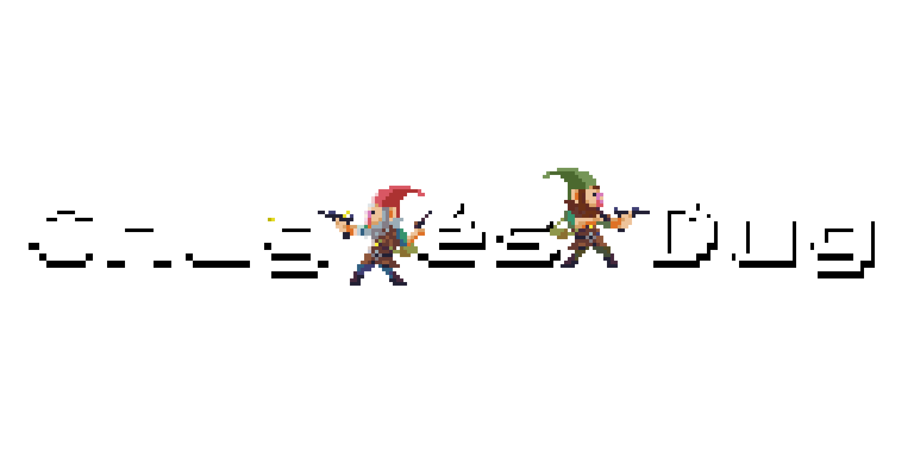

## Bevezetés
A **Chug és Dug** egy 2D platformer játék, amelyben a játékosoknak ellenségeket kell legyőzniük és arannyal teli üstöket kell gyűjteniük. A projekt célja egy szórakoztató és kihívást jelentő játék fejlesztése volt, amely egyszerű, de élvezetes játékmenetet kínál mind egyéni, mind többjátékos módban.

## Fejlesztési eszközök
A játék fejlesztése során az alábbi eszközöket használtam:
- **Unity** – játékmotor a grafika és fizika kezeléséhez
- **C#** – fő programozási nyelv
- **Aseprite** – pixel art grafika készítéséhez
- **Notepad++** – kódszerkesztéshez
- **HTML, CSS, JavaScript, PHP** – webes interfészekhez és adatkezeléshez
- **XAMPP** – helyi szerver környezet a backend fejlesztéséhez
- **Photon Unity Networking (PUN)** – többjátékos támogatás megvalósításához
- **MySQL** – adatbázis-kezelés a játékosadatok és eredmények tárolásához

## Játékmenet
- A játékos **három élettel** rendelkezik, és célja az **összes ellenség legyőzése** és az **üstök begyűjtése**.
- Az ellenségek különböző stratégiákkal támadnak, és legyőzhetők **ugrással a fejükre vagy lövedékekkel**.
- A **többjátékos mód** lehetővé teszi két játékos számára, hogy együttműködve teljesítsék a pályákat.
- Ha minden ellenséget és üstöt összegyűjtött a játékos, megnyílik egy ajtó, amely a következő pályára vezet.

)

## Rendszerkövetelmények
A játék futtatásához ajánlott minimum konfiguráció:
- **Windows:** 7+, 64-bit, DirectX10+
- **Hardver:** Intel Core i5/i7, 8GB RAM, integrált vagy dedikált GPU

## Fejlesztői dokumentáció
- **Menürendszer:** Főmenü, amely elérhetővé teszi az **egy- és többjátékos módot, a beállításokat és a kilépést**.
- **Adatbázis-kezelés:** Bejelentkezési rendszer, amely **MySQL adatbázisban** tárolja a játékosok adatait.
- **Szinkronizáció:** A **Photon szerver** felel a többjátékos interakciók megfelelő működéséért.
- **Ellenségek és AI:** Az ellenségek különböző mozgási és támadási mintázatokkal rendelkeznek.
- **Pályák és objektumok:** A pályák **tilemap rendszerrel** lettek kialakítva, amely lehetővé teszi az egyszerű bővíthetőséget.

## Tesztelés és hibajavítás
- A játékot több tesztfázisban ellenőriztem, beleértve a **mesterséges intelligencia viselkedését**, a **fizikai motor működését**, és a **multiplayer szinkronizációt**.
- Több hibát kijavítottam, mint például **karakterek szinkronizációs problémái, vizuális bugok, és szerveroldali adatkezelési hibák**.

## Továbbfejlesztési lehetőségek
A projekt a jövőben tovább bővíthető az alábbi funkciókkal:
- **Új pályák és ellenfelek hozzáadása.**
- **Többjátékos mód teljes szinkronizálása.**
- **Továbbfejlesztett ellenség AI és támadási mechanizmusok.**
- **Fejlettebb vizuális effektek és animációk.**
- **Egyedi karakterek és skinek testreszabása a játékosok számára.**

## Összegzés
A projekt megvalósítása során rengeteget tanultam a **játékfejlesztés folyamatáról**, különösen a **multiplayer rendszerek kezeléséről** és az **adatbázis-alapú játékállapot mentésről**. A Chug és Dug egy **stabil alapokkal rendelkező platformer játék**, amely a jövőben továbbfejleszthető és még szórakoztatóbbá tehető.
